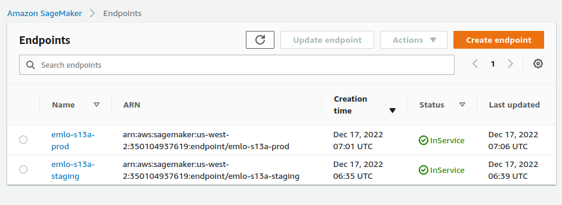

# EMLO Session 13

The goal of the assignment is to run an end-to-end pipeline using SageMaker.

# Docker Images
Custom docker images (with pytorch lightning/timm pre-installed) were reused from Session 12.

# Pipeline 


# Metrics
Besides the accuracy, the confusion matrix was also logged to the `evaluation.json` file.

```
self.conf_mat = MulticlassConfusionMatrix(num_classes=6)
confmat = self.conf_mat(preds, targs)
```

This file can be found [here](./evaluation.json)
# Predictions
Inference was performed on 2 images from each class


This was first done on the staging endpoint. After (manual) approval, a production endpoint was created. Inference on this endpoint also gave the same results.

